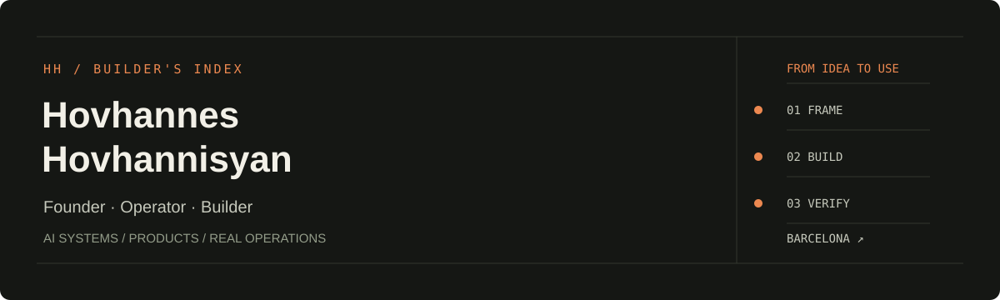

  

  <a href="https://hovhannes.dev"><strong>Portfolio ↗</strong></a> &nbsp;·&nbsp;
  <a href="https://www.linkedin.com/in/hovhanneshovhannisyan23/">LinkedIn</a> &nbsp;·&nbsp;
  <a href="mailto:hovhannes@novanestpro.com">Contact</a>

I build software around the way businesses actually work: decisions, customer conversations, operations and the handoffs between them. Based in Barcelona. Cofounder of **NovaNest Pro**.

My work combines product judgment, AI-assisted engineering and hands-on operations. I use hackathons to explore ideas quickly, then test what deserves to become a working product.

### Selected work

<table>
<tr>
<td width="50%" valign="top">
<h3>NovaNest Pro</h3>

AI-assisted workflows for home-service businesses: lead intake, reply approval, follow-up and booking.

<strong>Focus:</strong> product, business workflows and operator control.

<a href="https://novanestpro.com">Website ↗</a> · <a href="https://hovhannes.dev/novanest.html">Case study ↗</a> · <a href="https://hovo-novanest-demo.founder-website.workers.dev">Interactive demo ↗</a>

</td>
<td width="50%" valign="top">
<h3>The Little Light</h3>

A personalised family-book storefront connecting customer details and photos with a book-order workflow.

<strong>Focus:</strong> gifting UX, private uploads and order/payment integration. Product in development.

<a href="https://books.makeandsellgifts.com">View storefront ↗</a>

</td>
</tr>
<tr>
<td width="50%" valign="top">
<h3>ASEJ</h3>

A multilingual storefront for self-reflection agendas, with customer ordering and private operations.

<strong>Focus:</strong> commerce workflows, localisation and payment integration.

<a href="https://byasej.am">View storefront ↗</a>

</td>
<td width="50%" valign="top">
<h3>Loshik</h3>

An Armenian lavash venture connecting consumer interest, restaurant demand and bakery partners.

<strong>Focus:</strong> business validation and consumer/B2B enquiry workflows.

<a href="https://loshik.hovhannes.dev">View project ↗</a>

</td>
</tr>
<tr>
<td width="50%" valign="top">
<h3>Make &amp; Sell Gifts</h3>

Practical guides for people building personalised-gift businesses.

<strong>Focus:</strong> content systems, affiliate commerce and analytics.

<a href="https://makeandsellgifts.com">Explore site ↗</a>

</td>
<td width="50%" valign="top">
<h3>CALA SIGNAL</h3>

A startup-scouting prototype with deterministic ranking and traceable evidence, powered by Cala.

<strong>Hackathon prize:</strong> €1,000 from Aikido.ai for the product's security-focused approach.

<strong>Focus:</strong> research workflows, API integration and evidence quality.

<a href="https://cala-signal.hovohovhannisyan.chatgpt.site">Explore demo ↗</a>

</td>
</tr>
</table>

**More experiments:** [RTD multilingual product presentation ↗](https://vl-rtd.pages.dev/) — a static English/Russian concept site for product and packaging exploration.

### How I work

**Frame the operating problem → build a usable version → test the critical path → improve from evidence.**

I work across AI workflows, APIs, interfaces, automation and deployment. Depending on the project, I build directly or collaborate with engineering specialists. Roles and scope vary by project; linked demos and case studies show the work more clearly than a stack of badges.

### About the repositories

Most application code is private to protect product IP and customer data. This profile is a public index of projects, demos and case studies. Public portfolio material does not expose application source, credentials, customer records or private photos.

The **Intergalactic** repository on this account is a fork of [Semrush's design system](https://github.com/semrush/intergalactic); it is not an original project of mine. The slideshow repository is an early GitHub learning exercise.

---

Building something with a difficult operating constraint? [Let's talk](mailto:hovhannes@novanestpro.com).
